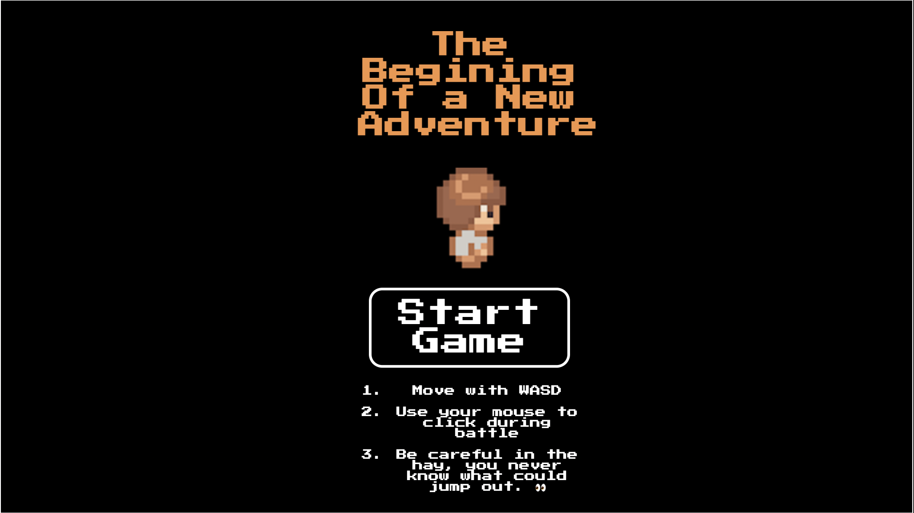

# The Beginning Of a New Adventure

## Description

Welcome to my first game! It is an RPG game built around earlier games from the 1990s and 2000s. With a self-designed map and a battle system in the village hay, this game is set up for consistent expandability. I used HTML, CSS, and Javascript to build a fully vanilla JS web browser game.
 
I plan to add new characters and dialogue with these characters. I also plan to code in a starting story and expand the game outside of our tiny village. I will add a few more monsters and a saving system for local saves.
 
I was able to apply all the concepts i've learned up to this point and utilized DOM manipulation and object-oriented programming. This game revolves heavily around classes and how to use them. I was also able to learn new "micro" concepts like canvas and how to actually render images into my game.
  
If you check it out, let me know If you have any feedback. It would help further my journey!

